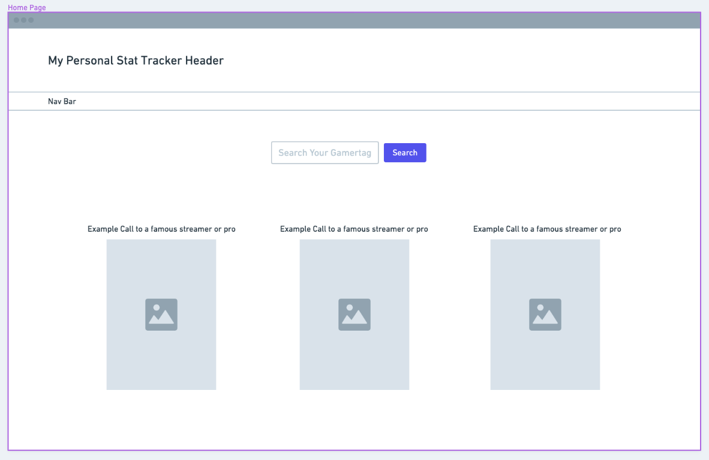
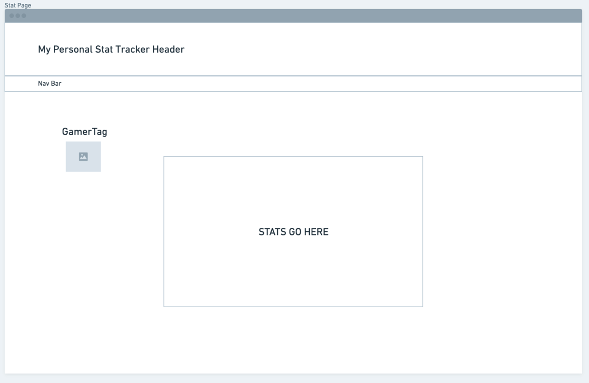
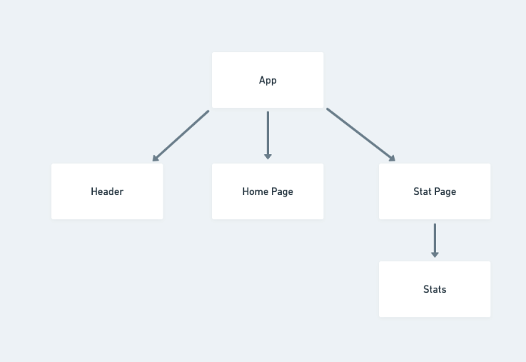

# Stats-Tracker

This React App is a video game stats tracker

## Project Description

My project is called My Stat Tracker. It is a stat tracker app for the video games that I play. My friends and I often play tournaments on the weekends and I would love to develop a tracker for everyone to keep up with their scores. There are different API’s for different games so I would have to do different queries for each one. Users will see a couple of famous streamers profiles with their stats and a search bar to input their own stats. In the future I may add a page for our actual tournaments to keep track of who is winning in real time.

## Wireframes

[Whimsical](https://whimsical.com/6pK31KWieLnW49SFuJqQLi) Wireframe

### MVP User Stories

As a user I want to be able to put in my own information and have my statistics given back to me

On the home page I want to have a couple Icons to click if I want to check my favorite streamer or Professionals stats

### MVP User Stretch Goals

As a user I would like to see advanced statistic of my games

As a user I would like to see more than just one games stats

## API

Link to the API's documentation you will use for your project.

[Tracker Network API](https://tracker.gg/developers/docs/getting-started)

[RIOT Games API](https://developer.riotgames.com/)

## Component Hierarchy

